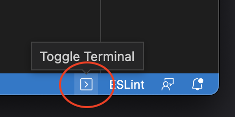

# ⚙️ Customise Visual Studio Code
> In this guide we will customise 

### 1️⃣ Install Plugins
VSCode comes with a extensions....


- Open the extension tab and install the following pluggins
  - [ESLint](https://marketplace.visualstudio.com/items?itemName=dbaeumer.vscode-eslint)
  - [Prettier](https://marketplace.visualstudio.com/items?itemName=SimonSiefke.prettier-vscode)
  - [Semantic Highlighting](https://marketplace.visualstudio.com/items?itemName=malcolmmielle.semantic-highlighting)
  - [Open Terminal](https://marketplace.visualstudio.com/items?itemName=whatwewant.open-terminal)
  - [PreviewJs](https://marketplace.visualstudio.com/items?itemName=zenclabs.previewjs)

### 2️⃣ Configure ESLint
ESLint is a ...

- Open a terminal window using `Open Terminal` extension and run:
  ```
  npm init @eslint/config
  ```
  

  > This should have created a `.eslintrc.js` on your root folder.

- Open `.eslintrc.js` and update the rules:
  ```angular2html
    'rules': {
      'quotes': ['error', 'single'],
      'semi': ['error', 'never'],
      'indent': ['error', 2],
      'react/prop-types': 0,
      'object-curly-spacing': ['error', 'always'],
      'no-unused-vars': 'off', // or "@typescript-eslint/no-unused-vars": "off",
      'unused-imports/no-unused-vars': 'off',
    }
  ```

### 3️⃣ Configure Prettier
Prettier is a ...

- Open `Settings.json` and add the following settings:
  ```
  "editor.tabSize": 2,
  "prettier.singleQuote": true,
  "prettier.semi": false,
  "prettier.printWidth": 140,
    "[javascript]": {         
      "editor.defaultFormatter": "esbenp.prettier-vscode"
   },
  ```

### 4️⃣ Run ESLint & Prettier on save
- Open `Settings.json` and add the following settings:
  ```
  "editor.codeActionsOnSave": {
    "source.fixAll.eslint": true
  },
  "eslint.validate": ["javascript"],
  "editor.formatOnSave": true,
  ```

> Now every time you save a js or jsx file your code will be formatted