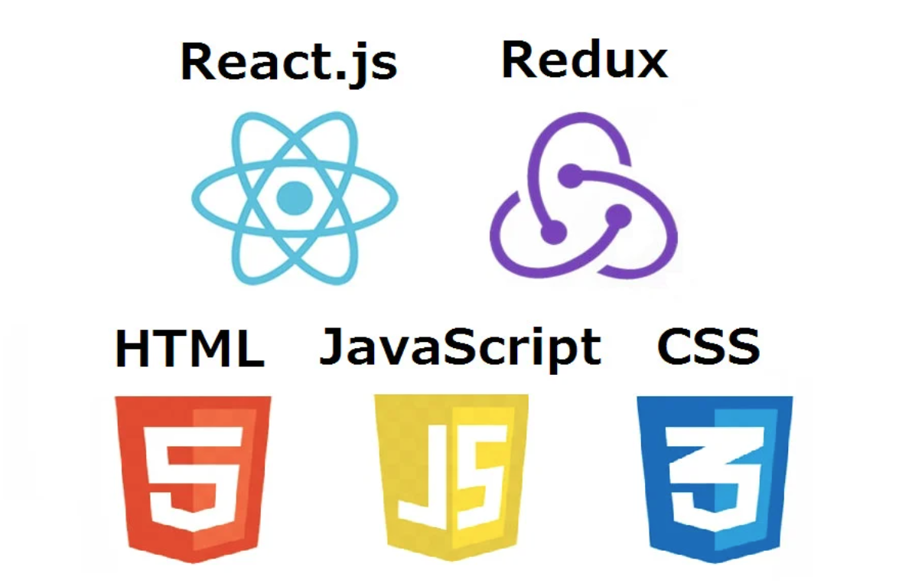

## The Complete Front-End Web Development Crash Course
#### Build Your CV and Find Your Dream Job

> Welcome to the Complete Front-End Web Development Crash Course! In this course, you will learn the essential skills needed to build websites and become a front-end developer.
> We will cover technologies such as HTML, CSS, and JavaScript, as well as frameworks such as React and TypeScript.
> By the end of this course, you will have the knowledge and skills to create dynamic, interactive websites.
>
> > In this course, we'll cover the content at a fast pace. We'll focus on the technologies and skills that are most useful for modern front-end jobs.
> > I encourage you to take your time and revisit each topic as needed to refresh your memory.

## Table of content
- ### [Module 1 | Basic Concepts](module1/README.md)
    > This module is designed to provide a foundational understanding of the key concepts needed to progress through the course.
    This will be a short review to ensure that you have a clear understanding of the material and that we're all on the same page.
    - [ Terminal](module1/terminal.md) / [Quiz](module1/terminal_quiz.md)
    - [ HTML](module1/html.md) / [Quiz](module1/html_quiz.md)
    - [ CSS](module1/css.md) / [Quiz](module1/css_quiz.md)
    - [ Javascript](module1/javascript.md) / [Quiz](module1/javascript_quiz.md)
    - [📝 Exercise](module1/exercise.md)
    - [☑️ Conclusion](module1/conclusion.md)

- ### [Module 2 | Getting Started](module2/README.md)
    > This module will guide you through the process of setting up your machine and installing all the necessary software, so you can start coding efficiently.
  - [🎒 Starter Pack](module2/starterPack.md)
  - [🛠 SSH](module2/ssh.md)
  - [👨‍🎨 Create First Repository](module2/createFirstRepository.md)
  - [🛠 Code Format (Eslint & Prettier)](module2/codeFormat.md)
    - [ VS-Code | Configuration Guide](module2/vscodeConfigurationGuide.md)
    - [ Web Storm | Configuration Guide](module2/webstormConfigurationGuide.md)
  - [☑️ Conclusion](module2/conclusion.md)

- ### [Module 3 | Code Playground](module3/README.md)
  > Module 3 we will start developing our first project using react and typescript.
  > We and go in more depth of some of the most important concepts required to be an efficient developer.
  > By the end of this module you will have a portfolio on the web that you can use it when applying for a job
  - [Todo List]()
  - [Router]()
  - [Basic Form]()
  - [Dynamic Form]()
  - [MUI]()
  - [Code Enhancements]()
  - [Redux]()
  - [Hanlde api requests]()
  - [Github pages]()

- ### Module 4 | Job Search
    > In Module 4, you will learn how to create a standout CV, apply for jobs, and excel in the interview process. By the end of this module, you will have the skills and confidence to effectively present your qualifications, apply for relevant positions, and secure your dream job.
  - [CV]()
  - [Where and How to apply for jobs]()
  - [Interview Skills]()
  - [What to expected]()
  - [What is expected from you]()

- ### Module 6 | Conclusion
  - [What have you learn so far]()
  - [How to learn]()
  - [How to search for code]()
  - [Developer mentality]()
  - [Next steps]()

## How to use this guide
> It is important to carefully read and follow this guide, as any mistakes in the steps could result in code that does not function correctly. Do not feel pressure to memorize all of the content in this guide - simply make sure to revisit each topic as needed to refresh your memory. Take your time and enjoy each step of the way, rather than rushing through the course.

## NEXT
[NEXT | Module 1 Basic Concepts](module1/README.md)