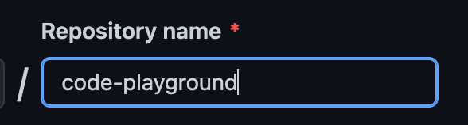

# 👨‍🎨 CREATE YOUR FIRST REPOSITORY

## Create React App
>We will be using the `create-react-app` command to generate our first app.
> Check out the full documentation on how to create a react app [here](https://reactjs.org/docs/create-a-new-react-app.html).
1. Open a terminal
2. Create a `projects` directory by running: 
    ```
    mkdir projects
    ```
3. Navigate to `projects` directory: 
    ```
    cd projects
    ```
4. Create a react app called `code-playground`:
    ```
    npx create-react-app code-playground
    ```
5. Navigate to `code-playground` and start the project:
    ```
    cd code-playground
    npm start
    ```
#### Congratulations! you have your first app up and running 🎉


## Create a github repository
1. [Create a new repository on Github](https://github.com/new)
2. Name it `code-playground`:
   
   
3. Leave all other options blank
4. Click on create repository:

   

## Push an existing app to Github
1. Open a terminal
2. Navigate to `code-playground` directory:
   ```
   cd projects/code-playground
    ```
3. Run these 3 commands, one at a time, and make sure to update `[YOUR-USERNAME]` with your github username:
   ```
   git remote add origin https://github.com/[YOUR-USERNAME]/code-playground.git
   git branch -M master
   git push -u origin master
   ```
#### Congratulations! Now you have your first repository in github 🎉

[NEXT | Code format with ESLint & Prettier](./CODE_FORMAT_WITH_ESLINT_&_PRETTIER.md)