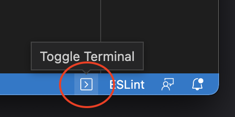

#  VS-CODE | CONFIGURATION

## Install Plugins
- Install the following pluggins
  - [ESLint](https://marketplace.visualstudio.com/items?itemName=dbaeumer.vscode-eslint)
  - [Prettier](https://marketplace.visualstudio.com/items?itemName=SimonSiefke.prettier-vscode)
  - [Semantic Highlighting](https://marketplace.visualstudio.com/items?itemName=malcolmmielle.semantic-highlighting)
  - [Rainbow Brackets](https://marketplace.visualstudio.com/items?itemName=2gua.rainbow-brackets)
  - [Open Terminal](https://marketplace.visualstudio.com/items?itemName=whatwewant.open-terminal)
  - [PreviewJs](https://marketplace.visualstudio.com/items?itemName=zenclabs.previewjs)

## Install ESLint

1. Open the embedded terminal window using `Open Terminal` extension:

    
2. Install ESLint by running:  
    ```
    npm init @eslint/config
    ```
3. When prompt with questions use this answers:
    ```
    How would you like to use ESLint?
    > To check syntax and find problems
    
    What type of modules does your project use? 
    > JavaScript modules (import/export)
   
    Which framework does your project use? 
    > React
   
    Does your project use TypeScript?
    > No 
   
    Where does your code run?
    > Browser & Node

    What format do you want your config file to be in? … 
    > JavaScript

    eslint-plugin-react@latest eslint@latest
    Would you like to install them now?
    > Yes
   
    Which package manager do you want to use? … 
    > npm
    ````
    > This should have created a `.eslintrc.js` on your root folder.

3. Open `.eslintrc.js` and update the rules:
    ```angular2html
    'rules': {
      'quotes': ['error', 'single'],
      'semi': ['error', 'never'],
      'indent': ['error', 2],
      'react/prop-types': 0,
      'object-curly-spacing': ['error', 'always'],
      'no-unused-vars': 'off', // or "@typescript-eslint/no-unused-vars": "off",
      'unused-imports/no-unused-vars': 'off',
    }
    ```


## Run ESLint on save
- Open `Settings.json` and add the following settings:
  ```
  "editor.codeActionsOnSave": {
    "source.fixAll.eslint": true
  },
  "eslint.validate": ["javascript"],
  ```

## Configure Prettier
- Open `Settings.json` and add the following settings:
  ```
  "editor.tabSize": 2,
  "prettier.singleQuote": true,
  "prettier.semi": false,
  "prettier.printWidth": 140,
    "[javascript]": {         
      "editor.defaultFormatter": "esbenp.prettier-vscode"
   },
  ```

## Run ESLint & Prettier on save
- Open `Settings.json` and add the following settings:
  ```
  "editor.formatOnSave": true,
  ```
  > Now every time you save a js or jsx file your code will be formatted
