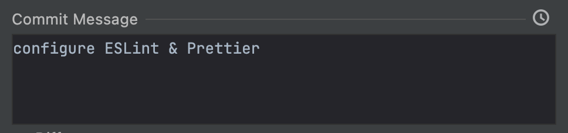

[The Complete Front-End Web Development Crash Course](../README.md) / [Module 2: Getting Started](./README.md)

#  Web Storm | Configuration Guide
> Learn how to configure WebStorm to work with ESLint and Prettier.

## Install Plugins
> Let's start by installing some plugins that will help us to work with our code.
- Install all the following plugins:
  - [Prettier](https://plugins.jetbrains.com/plugin/10456-prettier)
  - [Rainbow Brackets](https://plugins.jetbrains.com/plugin/10080-rainbow-brackets)

### Semantic Highlighting
> Semantic Highlighting is a feature that highlights the code based on its meaning. It helps us to identify the different parts of our code.
- In the `Settings/Preferences` dialog (⌘ ,), go to `Editor > Color Scheme > Language Defaults > Semantic Highlighting`
and check the option to enable `Semantic Highlighting`

    


## EsLint Configuration
1. Open the embedded Terminal using the shortcut `(⌥ F12)` or by clicking `Terminal` button on the bottom-left corner:

   
2. Install & configure `ESLint` using this command:
    ```
    npm init @eslint/config
    ```
3. When prompt with questions use this answers:  
    ```
    How would you like to use ESLint?
    > To check syntax and find problems
    
    What type of modules does your project use? 
    > JavaScript modules (import/export)
   
    Which framework does your project use? 
    > React
   
    Does your project use TypeScript?
    > No 
   
    Where does your code run?
    > Browser & Node

    What format do you want your config file to be in? … 
    > JavaScript

    eslint-plugin-react@latest eslint@latest
    Would you like to install them now?
    > Yes
   
    Which package manager do you want to use? … 
    > npm
    ````
   > This should have created a `.eslintrc.js` on your root folder.
4. Open `.eslintrc.js` and update the rules:
   ```
    'rules': {
      'quotes': ['error', 'single'],
      'semi': ['error', 'never'],
      'indent': ['error', 2],
      'react/prop-types': 0,
      'object-curly-spacing': ['error', 'always'],
      'no-unused-vars': 'off', // or "@typescript-eslint/no-unused-vars": "off",
      'unused-imports/no-unused-vars': 'off',
    }
   ```
   > Find out about ESLint rules [here](https://eslint.org/docs/latest/rules/).

### Run ESLint on save
- On Web-Storm, open `Preferences > Languages & Frameworks > Javascript > Code quality tools > ESLint`
check `Automatic ESLint configuration` and tick `run eslint on save`
  
    

## Install Prettier
1. Open the embedded Terminal `(⌥ F12)` and run:
    ```
    npm install --save-dev --save-exact prettier
    ```
2. Create an empty config file to let editors and other tools know you are using Prettier:
    ```
    echo {}> .prettierrc.json
    ```
3. Open `.prettierrc.json` and add the following options:
   ```
    {
      "arrowParens": "always",
      "bracketSpacing": true,
      "jsxBracketSameLine": false,
      "jsxSingleQuote": true,
      "printWidth": 120,
      "proseWrap": "preserve",
      "quoteProps": "preserve",
      "semi": false,
      "singleQuote": true,
      "tabWidth": 2,
      "trailingComma": "all",
      "useTabs": false
   }
    ```
4. In the `Settings/Preferences` dialog (⌘ ,), go to `Languages & Frameworks > JavaScript > Prettier`.
5. From the Prettier package list, select the prettier installation to use.
    > If you followed the standard installation procedure, WebStorm locates the prettier package itself and the field is filled in automatically.
6. Also tick the option to run prettier `onSave`

## Commit and push changes
1. Open the embedded Terminal `(⌥ F12)` and add new files to git:
   ```
   git add .prettierrc.json
   git add .eslintrc.js
   ```
2. Use the git toolbar on the top-right to commit changes:

   
3. Add a commit message:
   
   
4. Use the dropdown and click `Commit and Push`:
   
   

> Alternatively you can use the command line to perform the same action:
> ```
> git commit -M "configure ESLint & Prettier"
> git push
> ```

## NEXT
> Now we have our code editor configured, let's review what we have learned so far so we can move on to the next module.

[☑️ Conclusion](./conclusion.md)