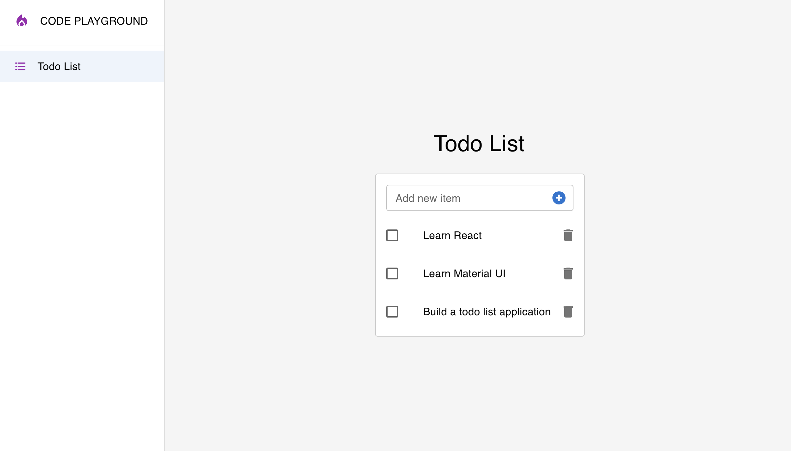

[The Complete Front-End Web Development Crash Course](../README.md) / [Module 3 | Code Playground](./README.md)

# SideBar & PageLayout
> In this section we will learn how to create a sidebar and a page layout.
> The sidebar will be used to navigate between projects we will build in this module.
> The page layout will be used to display the content of our application in a consistent way.

## 1. Create folder & files
> First, let's create the folder and files we will need for this section.
1. Create a folder named `pageLayout` inside the `components` folder.
2. Create 2 files inside the `pageLayout` folder:
    - `PageLayout.jsx`
    - `SideBar.jsx`

## 2. The PageLayout component
> The `PageLayout` component will be used to display the content of our application in a consistent way.
> It will make all content to be center aligned by default.
1. Open the `PageLayout.jsx` file.
2. Import the `React`, `Box` and the `SideBar` module.
   ```js
   import React from 'react';
   import { Box } from '@mui/material';
   import SideBar from './SideBar';
   ```
3. Create the `PageLayout` component.
   ```js
   const PageLayout = ({ children }) => {
     return (
       <Box sx={{ display: 'flex' }}>
         <SideBar />
         <Box
           sx={{ 
             display: 'flex',
             alignItems: 'center',
             justifyContent: 'space-around',
             flex: 1,
             backgroundColor: '#f5f5f5',
            }}
         >
           <Box>{children}</Box>
         </Box>
      </Box>
     );
   };
   ```
4. Export the `PageLayout` component.
   ```js
    export default PageLayout;
    ```
5. Open the `App.jsx` file.
6. Import the `PageLayout` component.
   ```js
   import PageLayout from './components/pageLayout/PageLayout';
   ```
7. Wrap the `TodoList` component with the `PageLayout` component.
   ```js
   function App() {
     return (
       <PageLayout>
          <TodoList />
       </PageLayout>
     );
   }
   ````
   
## 3. The SideBar component
> The `SideBar` component will be used to navigate between projects we will build in this module.
> It will be displayed on the left side of the page.
> It will be hidden on small screens.
1. Open the `SideBar.jsx` file.
2. Import the `React`, `Box`, `List`, `ListItem`, `ListItemIcon`, `ListItemText` and `Divider` modules.
   ```js
   import React from 'react';
   import {
    Box,
    List,
    ListItemText,
    Divider,
    Typography,
    ListItemButton,
   } from '@mui/material';
   import LocalFireDepartmentIcon from '@mui/icons-material/LocalFireDepartment';
   import FormatListBulletedIcon from '@mui/icons-material/FormatListBulleted';
   ```
3. Create the `SideBar` component.
   ```js
   const SideBar = () => {
     return (
       <Box
          sx={{
           height: '100vh',
           bgcolor: 'background.paper',
           borderRight: 1,
           borderColor: 'divider',
           display: { xs: 'none', sm: 'block' },
         }}
       >
         <Box
           sx={{
              display: 'flex',
              alignItems: 'center',
              justifyContent: 'flex-start',
              my: 3,
              px: 3,
           }}
         >
            <LocalFireDepartmentIcon color='secondary' sx={{ mr: 2 }} />
            <Typography>CODE PLAYGROUND</Typography>
         </Box>
         <Divider />
         <List>
           <ListItemButton sx={{ px: 3 }} selected>
             <FormatListBulletedIcon 
               color='secondary'
               fontSize='small'
               sx={{ mr: 2 }}
             />
             <ListItemText primary='Todo List' />
           </ListItemButton>
         </List>
       </Box>
     );
   };
   ```
   > Notice we added the Todo List item to the sidebar by default. we will add more items later as we build more projects.
4. Export the `SideBar` component.
    ```js
    export default SideBar;
    ```
> Now, if you run the application, you should see the sidebar on the left side of the page.



## NEXT
> In the next section we will learn how to create a router to navigate between pages.

[Router](./router.md)