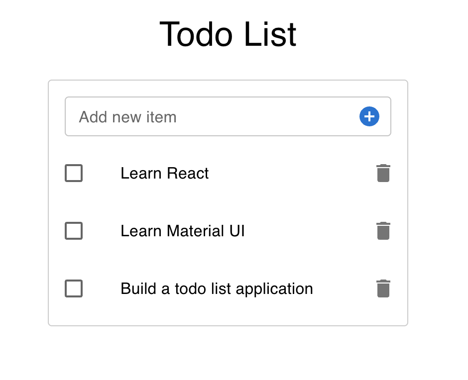

[The Complete Front-End Web Development Crash Course](../README.md) / [Module 3 | Code Playground](./README.md)

# Todo List
> In this section we will build a simple todo list application.
> We will be able to add, mark as completed and remove items in the list.



## 1. Install Material UI packages
> Material UI is a React UI framework that provides a set of components that can be used to build a user interface.
> It will help us to build our application faster and easier.
> We will start by installing the packages we will need for this application.

1. Open your terminal inside `code-playground` folder and run:
   ```shell
   npm install @mui/icons-material @mui/material @emotion/react @emotion/styled
   ```
## 2. Create folder & files
> We will start by creating a new folder for our project.
> At this point you should already have a repository called `code-playground` in your `projects` folder. 
> If you don't have it, please follow the instructions in the previous sections: 
> - [Introduction to React](../module2/introductionToReact.md)
> - [Create first repository](../module2/createFirstRepository.md)

1. Open `code-playground` folder in your IDE.
2. Inside the folder `src` create a new folder called `components`.
3. Inside the folder `components` create a folder called `todoList`.
4. Inside the folder `todoList` create 3 new files:
    - `TodoList.jsx`
    - `TodoListItem.jsx`
    - `CreateItem.jsx`

## 3. Connect new components to main App
> We will start by displaying the todo-list elements in the browser.
> We will use the `TodoList` component to display the list of items.
> We will use the `TodoListItem` component to display each item in the list.
> We will use the `CreateItem` component to create a new item in the list.

1. Open `TodoList.jsx` file.
2. Import the following packages:
   ```js
   import React, { useState } from 'react';
   import TodoListItem from './TodoListItem';
   import CreateItem from './CreateItem';
   ```
3. Create a new component called `TodoList`:
   ```js
    const TodoList = () => {
      return (
        <div>
          <h1>Todo List</h1>
        </div>
      );
    };
    ```
4. Export the component:
    ```js
    export default TodoList;
    ```
5. Open `TodoListItem.jsx` file.
6. Import the following packages:
   ```js
   import React from 'react';
   ```
7. Create a new component called `TodoListItem`:
   ```js
    const TodoListItem = () => {
      return (
        <div>
          <h1>Todo List Item</h1>
        </div>
      );
    };
    ```
8. Export the component:
    ```js
    export default TodoListItem;
    ```
9. Open `CreateItem.jsx` file.
10. Import the following packages:
   ```js
   import React from 'react';
   ```
11. Create a new component called `CreateItem`:
   ```js
    const CreateItem = () => {
      return (
        <div>
          <h1>Create Item</h1>
        </div>
      );
    };
 ```
12. Export the component:
    ```js
    export default CreateItem;
    ```
13. Open `TodoList.jsx` file.
14. Import the following packages:
   ```js
   import TodoListItem from './TodoListItem';
   import CreateItem from './CreateItem';
   ```
15. Add the following code inside the `TodoList` component:
   ```js
    return (
      <>
        <h1>Todo List</h1>
        <CreateItem />
        <TodoListItem />
      </>
    );
   ```
16. Open `App.jsx` file.
17. Import the following packages:
   ```js
   import TodoList from './components/todoList/TodoList';
   ```
18. Add the following code inside the `App` component:
   ```js
    return (
      <div>
        <TodoList />
      </div>
    );
   ```

## 4. Display a list of items
> We will start by displaying the list of items.
> We will use the `TodoListItem` component to display each item in the list.

1. Open `TodoList.jsx` file.
2. Create a new state called `items`:
   ```js
    const [items, setItems] = useState([]);
   ```
3. Set the initial value of the state `items`:
   ```js
    const [items, setItems] = useState([
      'Learn React',
      'Learn Material UI',
      'Build a todo list application',
    ]);
   ```
4. Now let's map over the `items` array and display each item in the list:
   ```js
    return (
      <>
        <h1>Todo List</h1>
        <CreateItem />
        {items.map((item) => (
          <TodoListItem key={item.id} item={item} />
        ))}
      </>
    );
   ```
5. Import the following MUI packages:
   ```js
   import { List, ListItem, Typography } from '@mui/material';
   ```
6. Wrap the `TodoListItem` component with the `List` component and replace the `h1` tag with the `Typography` component:
   ```js
    return (
      <>
        <Typography variant='h4' sx={{ textAlign: 'center', my: 3 }}>
          Todo List
        </Typography>
        <CreateItem />
        <List>
          {items.map((item) => (
            <TodoListItem key={item.id} item={item} />
          ))}
        </List>
      </>
    );
   ```
7. Open `TodoListItem.jsx` file.
8. Import the following packages:
   ```js
   import { ListItem, ListItemText } from '@mui/material';
   ```
9. Add the following code inside the `TodoListItem` component:
   ```js
    return (
      <ListItem disablePadding>
        <ListItemText primary={item} />
      </ListItem>
    );
   ```
10. Don't forget to define the `item` prop in the `TodoListItem` component:
    ```js
    const TodoListItem = ({ item }) => {
    ```
## 5. Add new item to the list
> We will start by adding a new item to the list.
> We will use the `CreateItem` component to create a new item in the list.


1. Open `CreateItem.jsx` file.
2. Import the following packages:
   ```js
   import React, { useState } from 'react';
   import { IconButton, InputAdornment, TextField } from '@mui/material';
   import AddCircleIcon from '@mui/icons-material/AddCircle';
   ```
3. Create a new state called `name`:
   ```js
    const [name, setName] = useState('');
   ```
4. Add the following code inside the `CreateItem` component:
   ```js
    return (
      <TextField
        fullWidth
        value={name}
        onChange={(e) => setName(e.target.value)}
        InputProps={{
          endAdornment: (
            <InputAdornment position='end'>
              <IconButton>
                <AddCircleIcon />
              </IconButton>
            </InputAdornment>
          ),
        }}
      />
    );
   ```
6. Create a new function called `handleAddItem`:
   ```js
    const handleAddItem = () => {
      onAddItem(name);
      setName('');
    };
   ```
   > Notice, we're resetting the `name` state to an empty string after adding the item to the list.
6. Add the `handleAddItem` function to the `onClick` event of the `IconButton` component:
   ```js
    <IconButton onClick={handleAddItem}>
   ```
7. Define the `onAddItem` prop in the `CreateItem` component:
   ```js
    const CreateItem = ({ onAddItem }) => {
   ```
8. Open `TodoList.jsx` file.
9. Add the `onAddItem` prop to `CreateItem`:
   ```js
    <CreateItem onAddItem={handleAddItem} />
   ```
10. Create a new function called `handleAddItem`:
    ```js
    const handleAddItem = (name) => {
      setItems([...items, name]);
    };
    ```
 > Check your browser on http://localhost:3000, you should be able to add a new item to the list.
   
## 6. Prevent adding an empty item to the list
> In this section we will prevent the user from adding an empty item to the list.
> We will use the `name` state to check if the user has typed in the input field.

1. Open `CreateItem.jsx` file.
2. Create a new state called `error`:
   ```js
    const [error, setError] = useState('');
   ```
   
3. Update the `handleAddItem` function:
   ```js
    const handleAddItem = () => {
      if (name) {
        onAddItem(name);
        setName('');
      } else {
        setError('Field is required');
      }
    };
   ```
   
4. Create a function `handleInputChange` to update the `name` state and set the `error` state to `false`:
   ```js
    const handleInputChange = (e) => {
      setName(e.target.value);
      setError('');
    };
   ```
   
5. And then, update the `TextField` component:
   ```js
    <TextField
      fullWidth
      value={name}
      onChange={handleInputChange}
      error={!!error}
      helperText={error}
      InputProps={{
        endAdornment: (
          <InputAdornment position='end'>
            <IconButton onClick={handleAddItem}>
              <AddCircleIcon />
            </IconButton>
          </InputAdornment>
        ),
      }}
    />
   ```
> Check your application and try to add an empty item to the list, you should see an error message.

## 7. Mark an item as completed
> Now, let's add the ability to mark an item as completed.
> We will use the `useState` hook to create a new state called `checked`.

1. Open `TodoListItem.jsx` file.
2. Import `Checkbox`, `ListItemIcon` and `ListItemButton` from `@mui/material` package:
3. Create a new state called `checked`:
   ```js
    const [checked, setChecked] = useState(false);
   ```
4. Add the following code inside the `TodoListItem` component:
   ```js
    return (
      <ListItem disablePadding>
        <ListItemButton onClick={() => setChecked(!checked)}>
          <ListItemIcon>
            <Checkbox edge='start' checked={checked} />
          </ListItemIcon>
          <ListItemText primary={item} />
        </ListItemButton>
      </ListItem>
    );
   ```
5. Cross out the item if it is completed:
   ```js
    <ListItemText
      primary={item}
      sx={{
        textDecoration: checked ? 'line-through' : 'none',
      }}
    />
   ```
> Check your application and try to mark an item as completed. 

## 8. Delete an item from the list
> Finally, let's add the ability to delete an item from the list.
> We will use the `onDeleteItem` function to delete an item from the list.

1. Open `TodoListItem.jsx` file.
2. Import `DeleteIcon` from `@mui/icons-material` package:
   ```js
   import DeleteIcon from '@mui/icons-material/Delete';
   ```
3. Add the delete button as a secondary action of the `ListItem` component:
   ```js
   <ListItem
     secondaryAction={
       <IconButton edge='end' onClick={onDelete}>
         <DeleteIcon />
       </IconButton>
     } 
     disablePadding
   >
   ```
4. Define the `onDelete` prop in the `TodoListItem` component:
   ```js
    const TodoListItem = ({ item, onDelete }) => {
   ```
   
5. Open `TodoList.jsx` file.
6. Create a new function called `handleDeleteItem`:
   ```js
    const handleDeleteItem = (index) => {
      const newItems = [...items];
      newItems.splice(index, 1);
      setItems(newItems);
    };
   ```
7. Add the `handleDeleteItem` function to the `onDelete` prop of the `TodoListItem` component:
   ```js
    <TodoListItem
      item={item}
      onDelete={() => handleDeleteItem(index)}
    />
   ```
   
> Congratulations! You have completed the tutorial. Check your application and try to add, mark as completed and delete an item from the list.

## NEXT
[SideBar & PageLayout](./sideBarAndPageLayout.md)