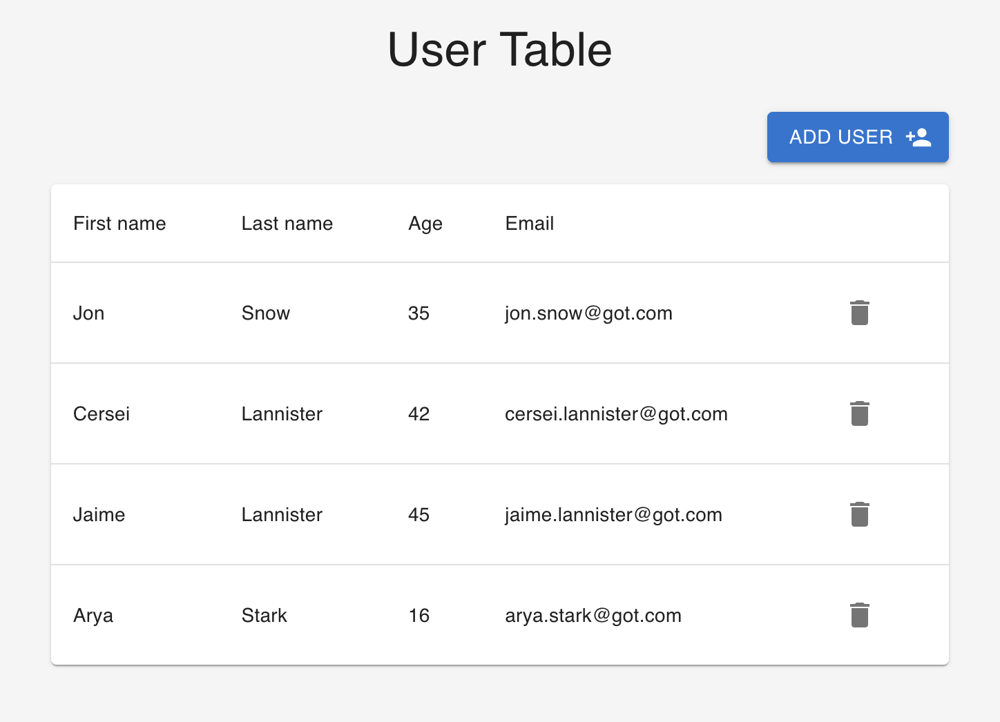

[The Complete Front-End Web Development Crash Course](../README.md) / [Module 4 | Code Playground Projects](./README.md)

#  User Table
> In this project we'll build a user table application.
> The application will display a list of users and their details.
> You'll be able to add new users and delete users.



## 1. Create base files
> First, let's create the base files for our project.
1. Inside the `components/modules` folder create a new folder called `userTable`.
2. Inside the `userTable` folder create 3 new files called `UserTable.tsx`, `Table.tsx` and `AddUserForm.tsx`.

## 2. Create a new route
> Next, let's create a new route for accessing the user table.
1. Open the `App.tsx` file.
2. Add the user table item to `siteData` array:
    ```tsx
    {
      name: 'User Table',
      route: '/user-table',
      element: <UserTable />,
      icon: GroupAddIcon,
    },
    ```
3. Import the `UserTable` component and `GroupAddIcon` from `@material-ui/icons`:
    ```tsx
    import UserTable from './components/modules/userTable/UserTable';
    import GroupAddIcon from '@material-ui/icons/GroupAdd';
    ```
   
## 3. Create a new reducer
> Next, let's create a new reducer for the user table.
1. Inside the `redux` folder create a new folder called `userTable`.
2. Inside the `userTable` folder create a new file called `userTableSlice.ts`.
3. Open the `userTableSlice.ts` file and add the following:
   ```ts
   import { UserTableListType, UserTableType } from '../../types';
   import { createSlice, PayloadAction } from '@reduxjs/toolkit';
   
   type UserTableState = {
     value: UserTableListType;
   };
   
   const initialState: UserTableState = {
     value: [
       {
         lastName: 'Snow',
         firstName: 'Jon',
         age: 35,
         email: 'jon.snow@got.com',
       },
       {
         lastName: 'Lannister',
         firstName: 'Cersei',
         age: 42,
         email: 'cersei.lannister@got.com',
       },
       {
         lastName: 'Lannister',
         firstName: 'Jaime',
         age: 45,
         email: 'jaime.lannister@got.com',
       },
       {
         lastName: 'Stark',
         firstName: 'Arya',
         age: 16,
         email: 'arya.stark@got.com',
       },
     ],
   };
   
   export const userTableSlice = createSlice({
     name: 'userTable',
     initialState,
     reducers: {
       addUser: (state, action: PayloadAction<UserTableType>) => {
         state.value.push(action.payload);
       },
       removeUser: (state, action: PayloadAction<number>) => {
         state.value.splice(action.payload, 1);
       },
     },
   });
   
   export const { addUser, removeUser } = userTableSlice.actions;
   
   export default userTableSlice.reducer;
   
   ```
4. Open the `types.ts` in the `src` folder file and add the following:
   ```ts
   export type UserTableType = {
     lastName: string;
     firstName: string;
     age: number;
     email: string;
   };
   
   export type UserTableListType = UserTableType[];
   ```
5. Open the `store.ts` file in `redux` folder.
6. Import the `userTableSlice` reducer and add it to the `rootReducer`:
   ```ts
   import useTableReducer from './userTable/userTableSlice';
   ```
7. Add the `userTableReducer` to the `rootReducer`:
   ```ts
   export const store = configureStore({
     reducer: {
       todoList: todoListReducer,
       theme: themeReducer,
       userTable: useTableReducer,
     },
   });
   ```
   
## 4. UserTable component
> Next, let's develop the `UserTable` component.


## NEXT
> We'll move on to the next project. Let's get started!

[ Social Media Post](./socialMediaPost.md)
