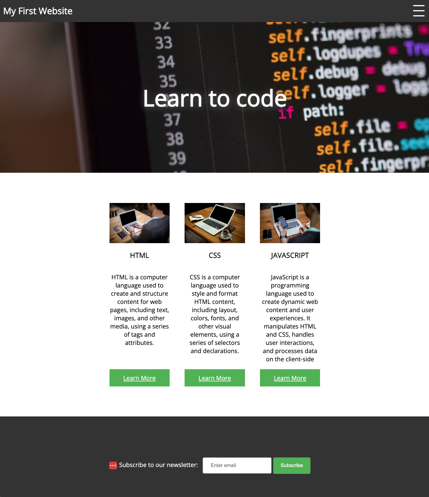

#### The Complete Front-End Web Development Crash Course / Module 1: Basic Concepts
#  Exercise 1 - My First Website

> Let's put all the learning into practice and create our first website.
> We will be using the technologies we learned in the previous lessons: HTML, CSS and JavaScript.
> Below we have a preview of the final result. You can also check the final result files [here](../solution/index.html).
> Follow these steps closely to ensure success.



#   Create folder structure & files
> Let's use the terminal to create the folder structure and files.
> We'll create a folder called `first-website` and inside it create 3 files: `index.html`, `style.css` and `script.js`.
> > If you're not familiar with the terminal, you can check the terminal lesson [here](../module_01/terminal.md).

- Open a terminal window and create a `projects` folder:
    ```shell
    mkdir projects
    ```
  > We will be creating this and all future websites inside this `projects` folder.
  > You can skip this step if you already have a `projects` folder in your root directory.
  
- Navigate to `projects` directory and create another folder called `first-website`:
    ```shell
    cd projects
    mkdir first-website
    ```
- Navigate to `first-website` directory and create the 3 files called `index.html`, `style.css` and `script.js`:
    ```shell
    cd first-website
    touch index.html
    touch style.css
    touch script.js
    ```
  
#  Add the HTML elements
> Let's add the HTML elements to our `index.html` file.
> We'll start by adding the basic HTML structure and then we'll add the elements we need for our website.
> If you're not familiar with HTML, you can check the [HTML lesson](../module_01/html.md) for more details.

### Basic HTML structure
> Let's start by adding the basic HTML structure to our `index.html` file.
- Open `index.html` and add the following code:
  ```html
  <!DOCTYPE html>
  <html>
  <head>
    <link rel="stylesheet" href="style.css">
    <link href="https://fonts.googleapis.com/css2?family=Open+Sans&display=swap" rel="stylesheet">
    <title>My First Website</title>
  </head>
  <body>
    // add your code here
    <script src="script.js"></script>
  </body>
  </html>
  ```
  > Notice we are linking to an external stylesheet called `style.css`
  > and a Google Font called `Open Sans` using the  tag `<link>`.
  > We are also linking to an external JavaScript file called `script.js` using the tag `<script>`.
  > 
  > We are also defining the title of the website using the `<title>` tag. This title will be displayed in the browser tab.
  
### The topbar component:
> The topbar contains the title of the website and a dropdown menu. 
> The dropdown menu is hidden by default and displayed when the user clicks on the burger menu.
> This behavior will be implemented using CSS and JavaScript.

- Add the following code inside the `<body>` element:
  ```html
  <div id="topbar">
    <h2>My First Website</h2>
    <div class="dropdown">
      <div onclick="dropdownFunction()" class="burger-menu">
        <div class="bar1"></div>
        <div class="bar2"></div>
        <div class="bar3"></div>
      </div>
      <div id="myDropdown" class="dropdown-content">
        <ul>
          <li>Item 1</li>
          <li>Item 2</li>
          <li>Item 3</li>
        </ul>
      </div>
    </div>
  </div>
  ```
  > Notice that `dropdownFunction()` is fired every time the user clicks on the `burger-menu` using the `onclick` attribute.
  > This function will be defined in `script.js` later.
  > We are also defining `classes` and `ids` that will be used to style those elements. 

### The hero component:
  > The hero component will be a wide image with a text inside center aligned. The image will be displayed using CSS with the `background-image` property.
- Add the following code inside the `<body>` element, below the topbar component:
  ```html
  <div class="hero-container">
    <h1>
      Learn to code
    </h1>
  </div>
  ```
  > We are defining `hero-container` class and using a `h1` tag for the center aligned text.
  
### The main content:
  > The main content contains 3 columns that contain a title, a paragraph and a link.
  > The columns are center aligned and its content is stretched to the full height of the column.
  > We will be using CSS to style the columns and the link.
- Add the following code inside the `<body>` element, below the hero component:
  ```html
  <div class="main-content">
    <div class="main-content-column">
      <h2>What is HTML?</h2>
      <p>
        HTML stands for Hyper Text Markup Language.
        It is the standard markup language for creating
        web pages and web applications. CSS and JavaScript,
        it forms a triad of cornerstone technologies
        for the World Wide Web.
      </p>
      <a
        href="https://developer.mozilla.org/en-US/docs/Web/HTML"
        target="_blank"
        class="learn-more-button"
      >
        Learn More
      </a>
    </div>
    <div class="main-content-column">
      <h2>What is CSS?</h2>
      <p>
        CSS stands for Cascading Style Sheets. CSS describes
        how HTML elements are to be displayed on screen,
        paper, or in other media. It can control the layout
        of multiple web pages all at once.
      </p>
      <a
        href="https://developer.mozilla.org/en-US/docs/Web/CSS"
        target="_blank"
        class="learn-more-button"
      >
        Learn More
      </a>
    </div>
    <div class="main-content-column">
      <h2>What is JavaScript?</h2>
      <p>
        JavaScript is a text-based programming language that
        allows you to make web pages interactive. Where HTML and CSS
        are languages that give structure and style to web pages,
        JavaScript gives web pages interactive elements that
        engage a user.
      </p>  
      <a
        href="https://developer.mozilla.org/en-US/docs/Web/JavaScript"
        target="_blank"
        class="learn-more-button"
      >
        Learn More
      </a>
    </div>
  </div>
  ```
  > Notice how we are breaking the text into multiple lines using the `<p>` tag. This is called `line wrapping`. It's a common practice to make the code more readable.
  > 
  > We are also breaking the `<a>` tag into multiple lines. It's also a common practice to make the code more readable.
  > The `target="_blank"` attribute will open the link in a new tab.

### The footer:
  > The footer is attached to the bottom of the page and contains a text center aligned.
- Add the following code inside the `<body>` element, below the main content:
  ```html
  <footer>
    <p>Created by <a href="https://www.linkedin.com/in/alexandru-georgescu-0b5b3b1b3/" target="_blank">Alexandru Georgescu</a></p>
  </footer>
  ```
## 🏁 Checkpoint:
> We have finished adding the HTML code to our `index.html` file.
> By this point, your `index.html` file should match the [result file `index.html`](./my-first-website/index.html)


#  Adding the CSS styles
> Now let's add the CSS styles to our `style.css` file.
> If you are not familiar with CSS syntax we're using here, you can check the [CSS lesson](./css.md).

### The body:
> The body selector contains the default styles for the page.
> We are setting the default font family to `Open Sans` and removing the default margin of the page.
- Open `style.css` file and add the following:
  ```css
  body {
    margin: 0; /* remove the default margin of the page */
    font-family: 'Open Sans', sans-serif; /* set the font family to Open Sans */
  }
  ```
### The topbar:
> The topbar selector contains the styles for the topbar component.
- Add the following code inside the `style.css` file, below the body selector:
  ```css
  /* CSS styles for the top bar */
  #topbar {
    background-color: #333; /* set the background color using a hex code */
    color: #fff; /* set the text color to white using hex code */
    display: flex; /* display the elements in a row */
    align-items: center; /* align the elements vertically to the center */
    justify-content: space-between;  /* add space between the elements */
    padding: 10px;  /* add padding to the elements in pixels */
    position: relative;  /* set the position to relative. This is needed for the dropdown menu */
  }
  
  #topbar h2 {
    margin: 0; /* remove the default margin of the h2 element */
  }
  ```
  > Notice we are using `id` selector for the `#topbar` instead of `class` selector. This is because we want to style only one element with the `id` `topbar`.
  > 
  > We're also using hex codes for the colors.
  > You can find more about hex codes and how it works [here](https://www.w3schools.com/colors/colors_hexadecimal.asp).

### The Topbar dropdown menu: 
> The dropdown menu will be displayed when the user clicks on the burger menu icon.
- Add the following code inside the `style.css` file, below the topbar selector:
  ```css
  /* CSS styles for the dropdown menu */
  .dropdown {
    position: relative; /* set the position to relative. This is needed for the dropdown menu */
    display: inline-block; /* display the elements in a row */
  }
  
  .burger-menu {
    width: 40px; /* set the width of the burger-menu element */
    height: 40px; /* set the height of the burger-menu element */
    display: flex; /* display the elements in a row */
    flex-direction: column; /* display the elements in a column */
    justify-content: space-around; /* add space between the elements */
    align-items: center; /* align the elements vertically */
    cursor: pointer; /* change the cursor to a pointer when the user hovers over the element */
  }
  
  .burger-menu-bar {
    width: 30px; /* set the width of the menu bar to 30 pixels */
    height: 3px; /* set the height of the menu bar to 3 pixels */
    background-color: rgb(255, 255, 255); /* set the background color to white using rgb */
  }
  
  .dropdown-content {
    display: none; /* hide the dropdown menu by default */
    position: absolute; /* set the position to absolute. This makes the dropdown menu appear on top of the other elements */
    right: 5px; /* set the element to be 5 pixels from the right of the topbar */
    background-color: #f9f9f9; /* set the background color using a hex code */
    min-width: 160px; /* set the minimum width of the dropdown menu to 160 pixels */
    box-shadow: 0 8px 16px 0 rgba(0,0,0,0.2); /* add a shadow to the dropdown menu */
    z-index: 1; /* set the z-index to 1. The z-index is used to position the element on top of the other elements */
  }
  
  ul {
    list-style: none; /* remove the bullet points */
    padding: 0; /* remove the default padding */
    margin: 0; /* remove the default margin */
    color: black; /* set the text color to black using a keyword */
  }
  
  li {
    padding: 10px; /* add padding to the list items to 10 pixels */
    background-color: transparent; /* set the default background color to transparent using a keyword */
    transition: background-color 0.3s ease; /* add a transition for the hover effect */
  }
  
  li:hover {
    background-color: rgba(0, 0, 0, 0.1); /* change the background color on hover to be a bit darker than the default background color using rgba */
    cursor: pointer; /* change the cursor to a pointer when the user hovers over the element */
  }
  ```
  > Notice how we are using `hex`, `rgb`, `keywords` and `rgba` for the colors.
  > You can find more about the different ways to define colors [here](https://www.w3schools.com/css/css_colors.asp).
  > 
  > We're also using the `position` property to position the dropdown menu on top of the other elements. You can find more about the `position` property [here](https://www.w3schools.com/css/css_positioning.asp).
  > 
  > Also, we're using the keyword `0` instead of `0px`. You can find more about the different ways to define 0 values [here](https://www.w3schools.com/cssref/pr_dim_zero.asp). 
  
### The Hero container:
> The hero-container selector contains the styles for the hero component.
- Add the following code inside the `style.css` file, below the dropdown menu selector:
  ```css
  .hero-container {
    text-align: center; /* center align the text */
    margin: auto; /* center the element horizontally */
    width: 100%; /* make the element the full width of its parent container */
    height: 400px;
    display: grid; /* enable grid layout */
    place-items: center center; /* center align the element both horizontally and vertically */
    background-image: url("https://images.unsplash.com/photo-1515879218367-8466d910aaa4?ixlib=rb-1.2.1&ixid=eyJhcHBfaWQiOjEyMDd9&auto=format&fit=crop&w=1350&q=80");
    background-size: cover;
    background-attachment: fixed;
    color: white;
  }

  .hero-container > h1 {
    margin: 0; /* remove the default margin of the h1 element */
    font-size: 60px; /* set the font size */
    font-weight: bold; /* set the font weight */
    text-shadow: 0 2px 16px rgba(0,0,0,0.8), 0 2px 16px rgba(255,255,255,0.5);
    /* add 2 text shadows separated by a comma */
  }
  ```
  > Notice we are using `>` selector to select the `h1` element inside the `hero-container` class.
  > This is to style only the `h1` element inside the `hero-container` class.
  > 
  > We're also setting the `background-image`, `background-size`, `background-attachment` to position the background image.
  > You can find more about the background property [here](https://www.w3schools.com/css/css_background.asp).

### The main content:
> The main-content selector contains the styles for the main content of the page
- Add the following code inside the `style.css` file, below the hero component selector:
  ```css
  /* CSS for thumbnail container */
  .main-content {
    display: flex; /* display the elements in a row */
    justify-content: center; /* center align the elements */
    align-items: stretch; /* stretch the elements to the full height of the container */
    max-width: 800px; /* set the maximum width of the container to 800 pixels */
    margin: 60px auto; /* center the element horizontally and add 60 pixels of margin on top and bottom */
  }
  
  /* CSS for thumbnail columns */
  .main-content-column {
    flex: 1; /* set the flex property to 1. This will make the columns equal width */
    text-align: center; /* center align the text */
    padding: 20px; /* add padding of 20 pixels */
    display: flex; /* display the elements in a row */
    flex-direction: column; /* display the elements in a column */
    justify-content: flex-start; /* align the elements to the top */
    align-items: center; /* center align the elements */
  }
  
  .main-content-column > p {
    flex: 1; /* set the flex property to 1. This will make the columns equal height */
  }
  
  /* CSS for button */
  .learn-more-button {
    background-color: #4CAF50; /* set the background color using a hex code */
    color: white; /* set the text color to white using a keyword */
    padding: 12px 0; /* add padding of 12 pixels on top and bottom and 0 pixels on left and right */
    border: none; /* remove the border */
    cursor: pointer; /* change the cursor to a pointer when the user hovers over the element */
    width: 100%; /* make the element the full width of its parent container */
    text-align: center; /* center align the text */
    align-self: flex-end; /* align the button to the bottom of the column */
    text-decoration: none; /* remove the underline from the text */
  }
  ```
  > Notice how we are setting spacing values using 2 values separated by a space like `padding: 20px 10px;`.
  > The first value is for the top and bottom and the second value is for the left and right.
  > You can also set the spacing values using 4 values separated by a space like `padding: 20px 10px 30px 40px;`.
  > The first value is for the top, the second value is for the right, the third value is for the bottom and the fourth value is for the left.
   
### The footer:
> The footer selector contains the styles for the footer.
- Add the following code inside the `style.css` file, below the thumbnail container selector:
  ```css
  footer {
    background-color: #333; /* set the background color using a hex code */
    color: #fff; /* set the text color to white using a hex code */
    padding: 20px; /* add padding of 20 pixels */
    text-align: center; /* center align the text */
    height: 200px; /* set the height of the element to 200 pixels */
    display: flex; /* display the elements in a row */
    align-items: center; /* center align the elements vertically */
    justify-content: space-around; /* add space between the elements */
  }
  ```

### The media queries:
> The media queries contain the styles for the page when the screen size is less than 600 pixels.
> The media queries will override the styles defined in the `style.css` file when the screen size is less than 600 pixels.
- Add the following code inside the `style.css` file, below the footer selector:
  ```css
  @media screen and (max-width: 600px) {
    .hero-container {
      height: 200px; /* set the height of the element to 200 pixels */
    }
  
    .hero-container > h1 {
      font-size: 30px; /* set the font size to 30 pixels */
    }
  
    .main-content {
      max-width: 400px; /* set the maximum width of the container to 400 pixels */
      flex-direction: column; /* display the elements in a column */
    }
  }
  ```
  > Notice how we are using `@media` to define the styles for the media queries.
  > The `@media` rule is followed by a media type and at least one media feature.
  
## 🏁 Checkpoint:
> We completed the CSS part of the project.
> At this point, your `style.css` file should match the [result file `style.css`](./my-first-website/style.css).

#  Adding the JavaScript code
> Finally, let's add the JavaScript code to toggle the dropdown menu when the user clicks on the burger menu.
> The `script.js` file contains the JavaScript code for the project.
> The JavaScript code will be used to toggle the dropdown menu when the user clicks on the burger menu.
- Open `script.js` and define a variable `dropdown`
  ```javascript
  var dropdown = document.getElementById("myDropdown");
  ```
  > The `document.getElementById()` method returns the element that has the ID attribute with the specified value.

- Define the function `dropdownFunction()`  
  ```javascript
  /* JavaScript function to toggle the dropdown menu */
  function dropdownFunction() {
    if (dropdown.style.display === "block") {
      dropdown.style.display = "none";
    } else {
      dropdown.style.display = "block";
    }
  }
  ```
  > The `dropdownFunction()` function will be called when the user clicks on the burger menu.
  > It will set a style property `display` to `block` or `none` depending on the current value of the property.
- Add an event listener to the `document` object for closing the dropdown menu.
  ```javascript
  /* Close dropdown menu when clicking away */
  document.addEventListener('click', (event) => {
    if (!event.target.matches('.burger-menu')) {
      dropdown.style.display = "none";
    }
  });
  ```
  > The `document.addEventListener()` method attaches an event handler to the document.
  > It will set the style property `display` to `none` when the user clicks away from the burger menu.

## 🏁 Checkpoint:
> Congratulations! You've completed all the steps of the exercise.
> At this point, you should have the following files in your project:
> - `index.html`
> - `style.css`
> - `script.js`
>
> The `index.html` file contains the HTML code for the project.
> The `style.css` file contains the CSS code for the project.
> The `script.js` file contains the JavaScript code for the project.
>
> Your `script.js` file should match the [result file `script.js`](./my-first-website/script.js).
> 
>> You can check the result files in the [solution folder](./my-first-website/README.md).

## Preview the project
> You can check the result of the project by opening the `index.html` file in your browser.

## NEXT
[NEXT | Conclusion](./conclusion.md)