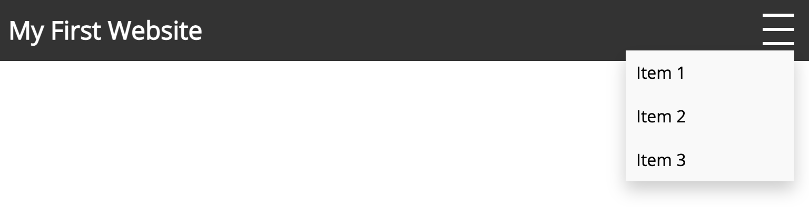

#### The Complete Front-End Web Development Crash Course / Module 1: Basic Concepts
#  Exercise

> Let's put all our learning into practice and create our first website. Follow these steps closely to ensure success.

# Folder structure
###  Terminal: Create a folder structure and files
- Open a terminal window and create a `projects` folder:
    ```shell
    mkdir projects
- Navigate to `projects` directory and create another folder called `first-website`:
    ```shell
    cd projects
    mkdir first-website
    ```
- Navigate to `first-website` directory and create a file called `index.html`:
    ```shell
    cd first-website
    touch index.html
    touch style.css
    touch script.js
    ```
  
###  HTML: Create the basic structure of the website
- Open `index.html` and paste the following code:
  ```html
  <!DOCTYPE html>
  <html>
  <head>
    <link href="https://fonts.googleapis.com/css2?family=Open+Sans&display=swap" rel="stylesheet">
    <link rel="stylesheet" href="style.css">
  </head>
  <body>
    // add your code here
    <script src="script.js"></script>
  </body>
  </html>
  ```
  > Notice we are linking to an external stylesheet called `style.css` and a Google Font called `Open Sans`.
  > We are also linking to an external JavaScript file called `script.js`
  

# Adding a dynamic Topbar
###  Adding the HTML elements
- Paste the following code inside the `<body>` element:
  ```html
  <div id="topbar">
    <h2>My First Website</h2>
    <div class="dropdown">
      <div onclick="dropdownFunction()" class="burger-menu">
        <div class="bar1"></div>
        <div class="bar2"></div>
        <div class="bar3"></div>
      </div>
      <div id="myDropdown" class="dropdown-content">
        <ul>
          <li>Item 1</li>
          <li>Item 2</li>
          <li>Item 3</li>
        </ul>
      </div>
    </div>
  </div>
  ```
  > The topbar contains the title of the website and a dropdown menu. The dropdown menu is hidden by default and will be displayed when the user clicks on the burger menu. 
  > Notice we are defining `classes` and `ids` like `class="burger-menu"` and `id="myDropdown"`. These will be used to style the elements. 
  > The `dropdownFunction()` function will be defined in `script.js` and will be explained later.

###  Adding the CSS styles

- Open `style.css` file and paste the following:
  ```css
  body {
    margin: 0; /* remove the default margin of the page */
    font-family: 'Open Sans', sans-serif; /* set the font family to Open Sans */
  }
  
  /* CSS styles for the top bar */
  #topbar {
    background-color: #333; /* set the background color using a hex code */
    color: #fff; /* set the text color */
    display: flex; /* display the elements in a row */
    align-items: center; /* align the elements vertically */
    justify-content: space-between;  /* add space between the elements */
    padding: 10px;  /* add padding to the elements */
    position: relative;  /* set the position to relative. This is needed for the dropdown menu */
  }
  
  #topbar h2 {
    margin: 0; /* remove the default margin of the h2 element */
  }
  
  /* CSS styles for the dropdown menu */
  .dropdown {
    position: relative; /* set the position to relative. This is needed for the dropdown menu */
    display: inline-block; /* display the elements in a row */
  }
  
  .burger-menu {
    width: 40px; /* set the width of the element */
    height: 40px; /* set the height of the element */
    display: flex; /* display the elements in a row */
    flex-direction: column; /* display the elements in a column */
    justify-content: space-around; /* add space between the elements */
    align-items: center; /* align the elements vertically */
    cursor: pointer; /* change the cursor to a pointer when the user hovers over the element */
  }
  
  .bar1, .bar2, .bar3 {
    width: 30px; /* set the width of the 3 elements bar1, bar2 and bar3 */
    height: 3px; /* set the height of the 3 elements */
    background-color: rgb(255, 255, 255); /* set the background color using rgb */
  }
  
  .dropdown-content {
    display: none; /* hide the dropdown menu by default */
    position: absolute; /* set the position to absolute. This is needed for the dropdown menu */
    right: 5px; /* set the right position */
    background-color: #f9f9f9; /* set the background color */
    min-width: 160px; /* set the minimum width */
    box-shadow: 0px 8px 16px 0px rgba(0,0,0,0.2); /* add a shadow to the dropdown menu */
    z-index: 1; /* set the z-index to 1. This is needed for the dropdown menu */
  }
  
  ul {
    list-style: none; /* remove the bullet points */
    padding: 0; /* remove the default padding */
    margin: 0; /* remove the default margin */
    color: black; /* set the text color */
  }
  
  li {
    padding: 10px; /* add padding to the list items */
    background-color: transparent; /* set the default background color */
    transition: background-color 0.3s ease; /* add a transition for the hover effect */
  }
  
  li:hover {
    background-color: rgba(0, 0, 0, 0.1); /* change the background color on hover */
    cursor: pointer; /* change the cursor to a pointer when the user hovers over the element */
  }
  ```
  
###  Adding the JavaScript code
- Open `script.js` and add the following code:
  ```javascript
  var dropdown = document.getElementById("myDropdown");
  
  /* JavaScript function to toggle the dropdown menu */
  function dropdownFunction() {
    if (dropdown.style.display === "block") {
      dropdown.style.display = "none";
    } else {
      dropdown.style.display = "block";
    }
  }
  
  /* Close dropdown menu when clicking away */
  document.addEventListener('click', (event) => {
    if (!event.target.matches('.burger-menu')) {
      dropdown.style.display = "none";
    }
  });
  ```
  > The `dropdownFunction()` function will be called when the user clicks on the burger menu. It will toggle the dropdown menu between `display: none` and `display: block`.

  > The `document.addEventListener()` function will be called when the user clicks anywhere on the page. It will close the dropdown menu if the user clicks away from the burger menu.
  
  > Notice we are using `document.getElementById()` to get the element with the id `myDropdown` and `document.addEventListener()` to add an event listener to the document.
  
  > We are also using `event.target.matches()` to check if the user clicked on the burger menu.
  
  > The `dropdown.style.display` property will be set to `block` when the user clicks on the burger menu and to `none` when the user clicks away from the burger menu.

# Testing the website
- Open `index.html` in your browser and you should see the following:
  
  

- Click on the burger menu and you should see the following:
  
  