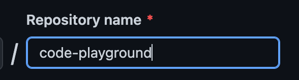

[The Complete Front-End Web Development Crash Course](../README.md) / [Module 2: Getting Started](../module_02/README.md)

# 👨‍🎨 CREATE YOUR FIRST REPOSITORY

## Create a github repository
1. [Create a new repository on Github](https://github.com/new)
2. Name it `code-playground`:
   
   
3. Leave all other options blank
4. Click on create repository:

   

## Push an existing app to Github
1. Open a terminal
2. Navigate to `code-playground` directory:
   ```
   cd projects/code-playground
    ```
3. Run these 3 commands, one at a time, and make sure to update `[YOUR-USERNAME]` with your github username:
   ```
   git remote add origin https://github.com/[YOUR-USERNAME]/code-playground.git
   git branch -M master
   git push -u origin master
   ```
#### Congratulations! Now you have your first repository in github 🎉

## NEXT
[NEXT | Code format with ESLint & Prettier](./CODE_FORMAT_WITH_ESLINT_&_PRETTIER.md)