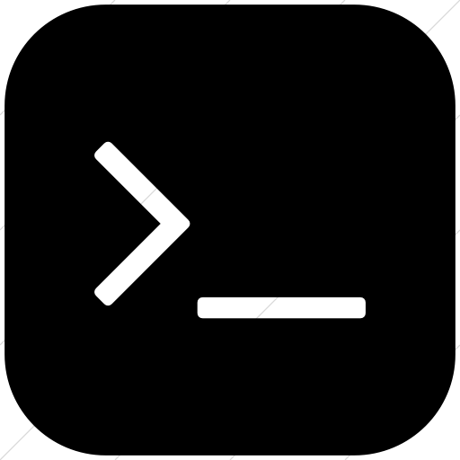

#### The Complete Front-End Web Development Crash Course / Module 1: Basic Concepts
#  Exercise 1 - Solution files

This folder contains the solution files for the first exercise of the first module of the course.

- 📂 `my-first-website`
  - [`index.html`](index.html)
  - [`style.css`](style.css)
  - [`script.js`](script.js)

## Preview the project
 You can check the result of the project by opening the `index.html` file in your browser.

[BACK | Back to exercise](../../module1/exercise.md)